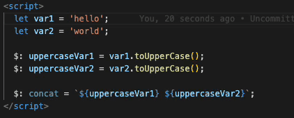

# Svelte Reactions

_Note: This is in very early stage development!_

Svelte reactions color codes svelte code that either is dependent or a dependency to the currently selected code.

Current limitations:

- Color coding only happens inside `<script>` tag. Color coding html is work in progress.
- Performance, haven't yet spend much time optimizing the code. Contributions are very welcome!
- Settings, not yet possible to do any configuration of the extension.
